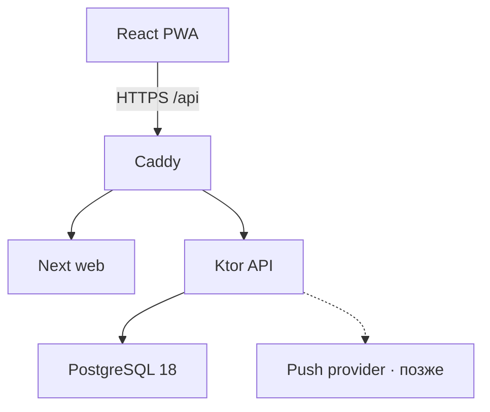
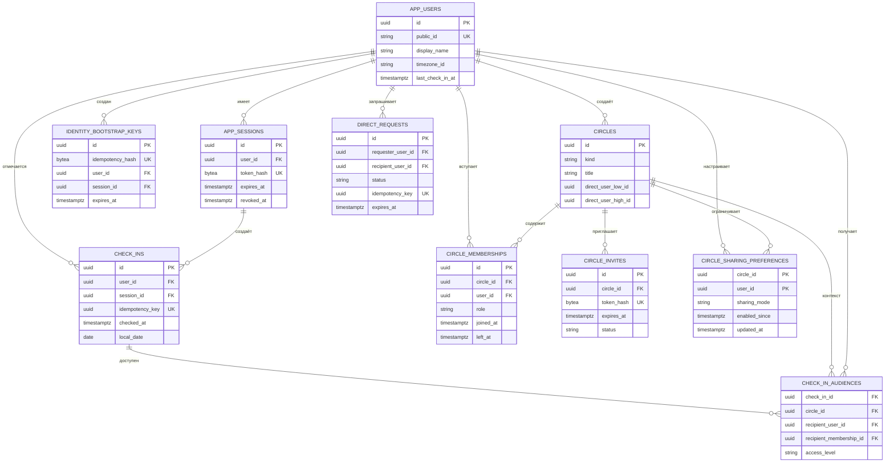

# Архитектура и ERD

## Контур

- Web: React 19, Next 16; код совместим с текущим Vinext/Vite checkpoint.
- API: Kotlin 2.4.10, Ktor 3.5.2, JDK 25.
- Data: PostgreSQL 18, HikariCP, JDBC для явных транзакций, Flyway SQL migrations.
- Runtime: Docker Compose на одном VPS; Caddy завершает TLS и проксирует `/api/**`.

## ERD

`DIRECT` хранит неизменяемую отсортированную пару пользователей прямо в `circles`, поэтому связь физически не может получить третьего участника. `GROUP` использует непересекающиеся исторические membership-строки: повторное вступление создаёт новую строку. Аудитория события содержит конкретного получателя и конкретный период membership — это исключает ретроактивную утечку истории. Requests и invites начинают только с `PENDING` и после терминального перехода не переписываются.

## HTTP 0.2

| Метод | Путь | Назначение |
|---|---|---|
| `POST` | `/api/v1/bootstrap` | создать пользователя и cookie-сессию; нужен `Idempotency-Key` |
| `GET` | `/api/v1/me` | получить себя и последнюю отметку |
| `POST` | `/api/v1/check-ins` | создать отметку; нужен `Idempotency-Key` |
| `GET` | `/api/v1/users/{publicId}` | найти пользователя и состояние связи |
| `GET` | `/api/v1/people` | люди, заявки и число получателей следующей отметки |
| `POST` | `/api/v1/direct-requests` | отправить взаимную заявку |
| `POST` | `/api/v1/direct-requests/{id}/{action}` | `accept`, `reject` или `cancel` |
| `PATCH` | `/api/v1/people/{circleId}/sharing` | включить или выключить новые отметки |
| `DELETE` | `/api/v1/people/{circleId}` | архивировать личную связь |
| `GET` | `/healthz` | liveness процесса |

Все identity/check-in ответы имеют `Cache-Control: no-store`. Записывающие запросы сверяют `Origin`, bootstrap ограничен по размеру и частоте. Сырой session token не логируется; запросы выполняются через same-origin Caddy. Встроенный Next API — только in-memory dev-адаптер и в production fail-closed без явного `ENABLE_DEV_API=true`.

Повтор bootstrap с тем же случайным UUIDv4 не создаёт новые годовые сессии: в течение десяти минут он ротирует токен одной связанной session-строки. В PWA незавершённые bootstrap/check-in ключи и неизменный payload временно лежат в `sessionStorage`, чтобы reload после потерянного ответа не создавал дубль.

## Атомарность check-in

1. Найти сессию и заблокировать строку пользователя `FOR UPDATE`.
2. Проверить повтор `Idempotency-Key`.
3. Взять `clock_timestamp()` из PostgreSQL.
4. Проверить 30-секундное окно.
5. Вставить событие и снимки разрешённых получателей, обновить `last_check_in_at`.
6. Закоммитить всё одной транзакцией.

Дополнительно exclusion constraint в PostgreSQL запрещает пересекающиеся cooldown-интервалы даже при ошибке прикладного кода.
