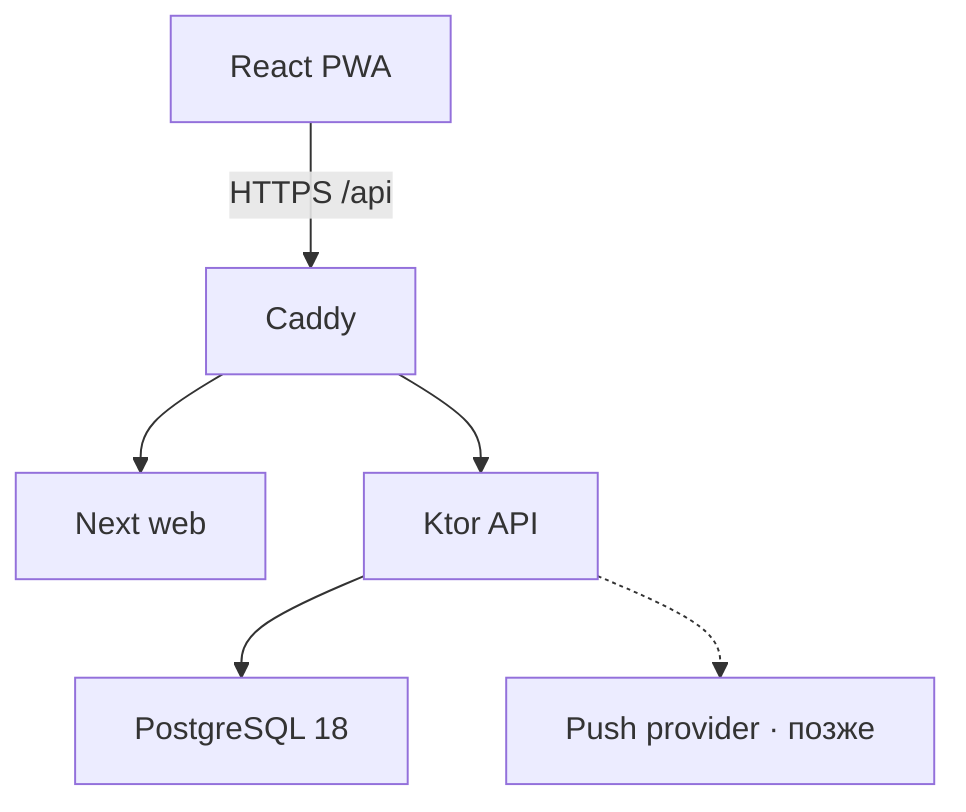
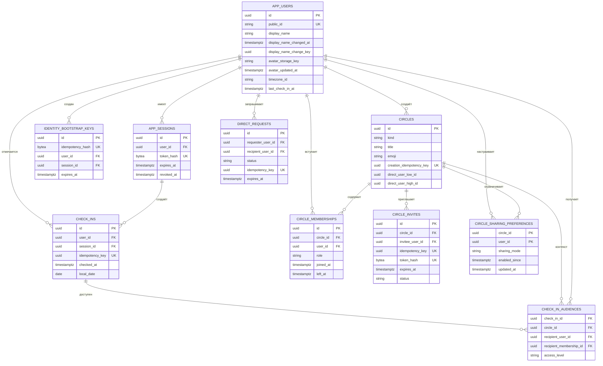

# Архитектура и ERD

## Контур

- Web: React 19, Next 16; код совместим с текущим Vinext/Vite checkpoint.
- API: Kotlin 2.4.10, Ktor 3.5.2, JDK 25.
- Data: PostgreSQL 18, HikariCP, JDBC для явных транзакций, Flyway SQL migrations.
- Runtime: Docker Compose на одном VPS; Caddy завершает TLS и проксирует `/api/**`.

## ERD

`DIRECT` хранит неизменяемую отсортированную пару пользователей прямо в `circles`, поэтому связь физически не может получить третьего участника. `GROUP` использует непересекающиеся исторические membership-строки: повторное вступление создаёт новую строку. Аудитория события содержит конкретного получателя и конкретный период membership — это исключает ретроактивную утечку истории. Requests и invites начинают только с `PENDING` и после терминального перехода не переписываются.

## HTTP 0.4

| Метод | Путь | Назначение |
|---|---|---|
| `POST` | `/api/v1/bootstrap` | создать пользователя и cookie-сессию; нужен `Idempotency-Key` |
| `GET` | `/api/v1/me` | получить себя, последнюю отметку, стрик, профиль и подтверждённый счётчик |
| `PATCH` | `/api/v1/me` | изменить отображаемое имя раз в 24 часа; нужен `Idempotency-Key` |
| `POST` | `/api/v1/check-ins` | создать отметку; нужен `Idempotency-Key` |
| `GET` | `/api/v1/users/{publicId}` | найти пользователя и состояние связи |
| `GET` | `/api/v1/people` | люди, заявки и число получателей следующей отметки |
| `POST` | `/api/v1/direct-requests` | отправить взаимную заявку |
| `POST` | `/api/v1/direct-requests/{id}/{action}` | `accept`, `reject` или `cancel` |
| `PATCH` | `/api/v1/people/{circleId}/sharing` | включить или выключить новые отметки |
| `DELETE` | `/api/v1/people/{circleId}` | архивировать личную связь |
| `GET` | `/api/v1/groups` | группы, участники и входящие/исходящие приглашения |
| `POST` | `/api/v1/groups` | создать группу и начальные приглашения |
| `PATCH` | `/api/v1/groups/{groupId}` | изменить название и emoji; только владелец |
| `DELETE` | `/api/v1/groups/{groupId}` | закрыть membership-периоды и архивировать группу |
| `PATCH` | `/api/v1/groups/{groupId}/sharing` | включить или выключить новые отметки через группу |
| `POST` | `/api/v1/groups/{groupId}/invites` | пригласить подтверждённый личный контакт |
| `DELETE` | `/api/v1/groups/{groupId}/invites/{inviteId}` | отозвать приглашение |
| `POST` | `/api/v1/group-invites/{inviteId}/{action}` | `accept` или `reject` |
| `DELETE` | `/api/v1/groups/{groupId}/members/{membershipId}` | выйти или удалить участника |
| `GET` | `/healthz` | liveness процесса |

Все API-ответы с личными данными имеют `Cache-Control: no-store`. Записывающие запросы сверяют `Origin` и требуют UUIDv4 `Idempotency-Key`. Сырой session token не логируется; запросы выполняются через same-origin Caddy. Встроенный Next API — только in-memory dev-адаптер и в production fail-closed без явного `ENABLE_DEV_API=true`.

Каждый элемент `GET /api/v1/people` содержит `checkInState`: `HIDDEN`, `WAITING_INITIAL`, `WAITING_AFTER_REENABLE` или `AVAILABLE`. Состояние вычисляет сервер по текущему sharing-периоду и audience snapshot; клиент не угадывает причину `lastCheckInAt = null` и не получает точный момент переключения доступа.

Повтор bootstrap с тем же случайным UUIDv4 не создаёт новые годовые сессии: в течение десяти минут он ротирует токен одной связанной session-строки. В PWA незавершённые bootstrap/check-in ключи и неизменный payload временно лежат в `sessionStorage`, чтобы reload после потерянного ответа не создавал дубль.

Стрик не хранится изменяемым счётчиком. PostgreSQL-функция `daily_check_in_streak` читает уникальные `check_ins.local_date`, использует один зафиксированный `server_time` и часовой пояс пользователя, возвращая текущую/лучшую серию, факт отметки сегодня и абсолютное время следующей локальной полуночи. Поэтому миграция сразу учитывает старую историю и повторные отметки одного дня не искажают серию.

Переименование выполняется под той же блокировкой пользователя `FOR UPDATE`, что и check-in. Репозиторий сначала обрабатывает no-op и повтор ключа, затем проверяет точный интервал `display_name_changed_at + 24 hours`. Публичный ID неизменяем. Поля будущей аватарки хранят только приватный object key и время обновления; ни одно из них пока не выходит в HTTP.

## Атомарность check-in

1. Найти сессию и заблокировать строку пользователя `FOR UPDATE`.
2. Проверить повтор `Idempotency-Key`.
3. Взять `clock_timestamp()` из PostgreSQL.
4. Проверить 30-секундное окно.
5. Вставить событие и снимки разрешённых получателей, обновить `last_check_in_at`.
6. Закоммитить всё одной транзакцией.

Дополнительно exclusion constraint в PostgreSQL запрещает пересекающиеся cooldown-интервалы даже при ошибке прикладного кода.

Снимки для групп берутся из активного membership-периода и `circle_sharing_preferences`. Получатель записывается вместе с конкретным `recipient_membership_id`; поэтому вступление заново не открывает прежнюю историю. `check_ins` и `check_in_audiences` append-only. Отображаемый счётчик отметок вычисляется по этим событиям, а idempotent replay возвращает порядковый номер исходного события.
