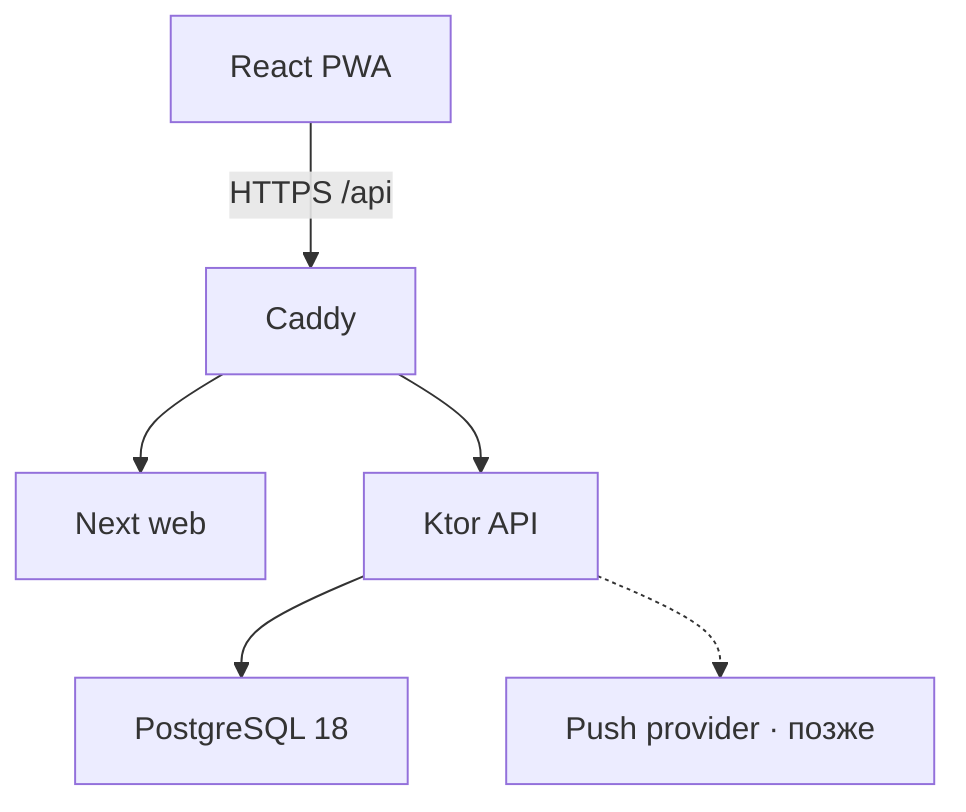
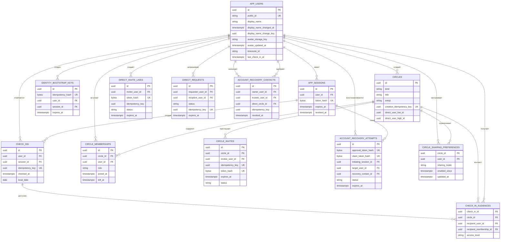

# Архитектура и ERD

## Контур

- Web: React 19, Next 16; код совместим с текущим Vinext/Vite checkpoint.
- API: Kotlin 2.4.10, Ktor 3.5.2, JDK 25.
- Data: PostgreSQL 18, HikariCP, JDBC для явных транзакций, Flyway SQL migrations.
- Runtime: Docker Compose на одном VPS; Caddy завершает TLS и проксирует `/api/**`.

## ERD

`DIRECT` хранит неизменяемую отсортированную пару пользователей прямо в `circles`, поэтому связь физически не может получить третьего участника. `GROUP` использует непересекающиеся исторические membership-строки: повторное вступление создаёт новую строку. Аудитория события содержит конкретного получателя и конкретный период membership — это исключает ретроактивную утечку истории. Requests, invites и recovery attempts начинают только с `PENDING`; переходы их состояний проверяются транзакциями и ограничениями БД. Capability-токены хранятся только как 32-байтные hashes.

## HTTP 0.4

| Метод | Путь | Назначение |
|---|---|---|
| `POST` | `/api/v1/bootstrap` | создать пользователя и cookie-сессию; нужен `Idempotency-Key` |
| `GET` | `/api/v1/me` | получить себя, последнюю отметку, стрик, профиль и подтверждённый счётчик |
| `PATCH` | `/api/v1/me` | изменить отображаемое имя раз в 24 часа; нужен `Idempotency-Key` |
| `POST` | `/api/v1/check-ins` | создать отметку; нужен `Idempotency-Key` |
| `POST` | `/api/v1/game-events` | принять один агрегированный итог локальной игровой серии; ответ `204` |
| `GET` | `/api/v1/users/{publicId}` | найти пользователя и состояние связи |
| `GET` | `/api/v1/people` | люди, заявки и число получателей следующей отметки |
| `POST` | `/api/v1/direct-requests` | отправить взаимную заявку |
| `POST` | `/api/v1/direct-requests/{id}/{action}` | `accept`, `reject` или `cancel` |
| `PATCH` | `/api/v1/people/{circleId}/sharing` | включить или выключить новые отметки |
| `DELETE` | `/api/v1/people/{circleId}` | архивировать личную связь |
| `POST` | `/api/v1/direct-invite-links` | создать одноразовое приглашение сроком до 7 дней; новая ссылка отзывает предыдущую |
| `POST` | `/api/v1/direct-invite-links/preview` | показать автора приглашения по fragment-token |
| `POST` | `/api/v1/direct-invite-links/redeem` | один раз принять ссылку и создать личную связь |
| `GET` | `/api/v1/groups` | группы, участники и входящие/исходящие приглашения |
| `POST` | `/api/v1/groups` | создать группу и начальные приглашения |
| `PATCH` | `/api/v1/groups/{groupId}` | изменить название и emoji; только владелец |
| `DELETE` | `/api/v1/groups/{groupId}` | закрыть membership-периоды и архивировать группу |
| `PATCH` | `/api/v1/groups/{groupId}/sharing` | включить или выключить новые отметки через группу |
| `POST` | `/api/v1/groups/{groupId}/invites` | пригласить подтверждённый личный контакт |
| `DELETE` | `/api/v1/groups/{groupId}/invites/{inviteId}` | отозвать приглашение |
| `POST` | `/api/v1/group-invites/{inviteId}/{action}` | `accept` или `reject` |
| `DELETE` | `/api/v1/groups/{groupId}/members/{membershipId}` | выйти или удалить участника |
| `GET` | `/api/v1/recovery-contacts` | доверенные, доступные и доверившиеся recovery-контакты |
| `POST` | `/api/v1/recovery-contacts` | назначить активную личную связь; максимум три |
| `DELETE` | `/api/v1/recovery-contacts/{contactId}` | отозвать доверие |
| `POST` | `/api/v1/account-recovery/attempts` | зарегистрировать клиентский approval-token и начать попытку; fragment-ссылку строит клиент |
| `GET` | `/api/v1/account-recovery/attempts/current` | проверить попытку по recovery claim-cookie |
| `DELETE` | `/api/v1/account-recovery/attempts/current` | отменить незавершённую попытку в исходном браузере |
| `POST` | `/api/v1/account-recovery/attempts/current/complete` | завершить одобренный вход в исходном браузере |
| `POST` | `/api/v1/account-recovery/approval/preview` | другу увидеть заранее доверившиеся активные профили |
| `POST` | `/api/v1/account-recovery/approval/confirm` | другу одобрить один выбранный профиль |
| `GET` | `/healthz` | liveness процесса |
| `GET` | `/readyz` | readiness API и PostgreSQL; `503` без БД |

Все API-ответы с личными данными имеют `Cache-Control: no-store`. Записывающие запросы сверяют `Origin`. Операции, для которых повтор после потерянного ответа может создать неоднозначность, требуют UUIDv4 `Idempotency-Key`; явная отмена recovery-attempt идемпотентна по текущей claim-cookie, а агрегированное игровое событие дедуплицируется по `eventId` в body. Сырой session token не логируется; запросы выполняются через same-origin Caddy. Встроенный Next API — только in-memory dev-адаптер и в production fail-closed без явного `ENABLE_DEV_API=true`.

Кликер остаётся локальной развлекательной механикой: активная и лучшая серии не входят в модель безопасности и не изменяют `check_ins`. Уровень вычисляется отдельно по `lifetimeTaps`, который хранится локально с namespace публичного ID; это прогресс данного браузера, а не серверная статистика аккаунта. В начале серии создаётся UUIDv4 события и сохраняется вместе с активной серией; после 30 секунд покоя клиент отправляет один строго валидируемый `CLICKER_SERIES_FINISHED`, а bounded in-memory дедупликация подавляет повтор этого UUID после reload или из второй вкладки. Сам UUID в operational log не записывается. Сервер помечает значения как `client_reported=true` и отдельно пишет privacy-safe исходы `check_in_accepted`, `check_in_replayed` и `check_in_cooldown`. Access-log не содержит URI, поэтому публичный ID из lookup-пути не попадает в журналы. Ошибка телеметрии игнорируется клиентом и не влияет на отметку.

Каждый элемент `GET /api/v1/people` содержит `checkInState`: `HIDDEN`, `WAITING_INITIAL`, `WAITING_AFTER_REENABLE` или `AVAILABLE`. Состояние вычисляет сервер по текущему sharing-периоду и audience snapshot; клиент не угадывает причину `lastCheckInAt = null` и не получает точный момент переключения доступа.

Повтор bootstrap с тем же случайным UUIDv4 не создаёт новые годовые сессии: в течение десяти минут он ротирует токен одной связанной session-строки. В PWA незавершённые bootstrap/check-in ключи и неизменный payload временно лежат в `sessionStorage`, чтобы reload после потерянного ответа не создавал дубль.

Стрик не хранится изменяемым счётчиком. PostgreSQL-функция `rolling_check_in_streak` читает принятые `check_ins` по серверному `checked_at`, строит последовательности с разрывом не более 24 часов и использует один зафиксированный `server_time`. `renewBy` всегда равен последней отметке плюс 24 часа; timezone, локальная дата и полночь в расчёте не участвуют. Повторные отметки продлевают окно, а длина последовательности растёт только после полного 24-часового интервала от её начала.

Цвет главной кнопки — непрерывная функция возраста последней подтверждённой отметки относительно `serverTime`: серый до первой отметки, затем зелёный → янтарный → красный на интервале 0–24 часа и красный позже. Клиент периодически пересчитывает цель и плавно интерполирует CSS custom properties, не подменяя серверное время локальными часами.

Direct invite и recovery approval используют fragment URL, поэтому capability не попадает в HTTP request target или access-log. Приглашение одноразовое и живёт до 7 дней; выпуск новой ссылки отзывает предыдущую. В восстановлении approval-token не является credential: браузер, в котором пользователь возвращает доступ, одновременно получает отдельный claim-secret в `Secure; HttpOnly; SameSite=Strict` cookie (`__Host-zhiv_recovery` в production). Аутентифицированный друг может только одобрить заранее доверившийся ему профиль. Только исходный браузер предъявляет claim cookie и завершает попытку; completion под блокировками повторно проверяет активную `DIRECT`-связь, отзывает старые сессии цели, случайную initiating-сессию, все recovery-контакты кроме одобрившего, все pending direct-invite ссылки, исходящие direct requests и group invites цели, а также ещё не завершённые восстановления, ранее одобренные целевым профилем для других людей. Затем claim-secret повышается до новой обычной сессии того же пользователя. TTL попытки — 10 минут; start, confirm и complete идемпотентны.

`/healthz` проверяет жизнь процесса, а `/readyz` с коротким bounded cache выполняет `SELECT 1` и возвращает `503` без деталей ошибки при недоступном PostgreSQL. Compose ждёт healthy dependencies, ограничивает Docker logs и проксирует readiness через Caddy. CI выполняет web lint/typecheck/build/tests, Kotlin tests, обязательный PostgreSQL integration suite и production Compose smoke. Проверяемый off-host `pg_dump` + restic backup и отдельный restore drill описаны в [operations.md](operations.md).

Переименование выполняется под той же блокировкой пользователя `FOR NO KEY UPDATE`, что и check-in. Она сериализует мутации профиля и восстановления, оставаясь совместимой с FK `KEY SHARE`. Репозиторий сначала обрабатывает no-op и повтор ключа, затем проверяет точный интервал `display_name_changed_at + 24 hours`. Публичный ID неизменяем. Поля будущей аватарки хранят только приватный object key и время обновления; ни одно из них пока не выходит в HTTP.

## Атомарность check-in

1. Найти сессию, заблокировать строку пользователя `FOR NO KEY UPDATE` и повторно проверить точную сессию под этой блокировкой.
2. Проверить повтор `Idempotency-Key`.
3. Взять `clock_timestamp()` из PostgreSQL.
4. Проверить 30-секундное окно.
5. Вставить событие и снимки разрешённых получателей, обновить `last_check_in_at`.
6. Закоммитить всё одной транзакцией.

Дополнительно exclusion constraint в PostgreSQL запрещает пересекающиеся cooldown-интервалы даже при ошибке прикладного кода.

Снимки для групп берутся из активного membership-периода и `circle_sharing_preferences`. Получатель записывается вместе с конкретным `recipient_membership_id`; поэтому вступление заново не открывает прежнюю историю. `check_ins` и `check_in_audiences` append-only. Отображаемый счётчик отметок вычисляется по этим событиям, а idempotent replay возвращает порядковый номер исходного события.
