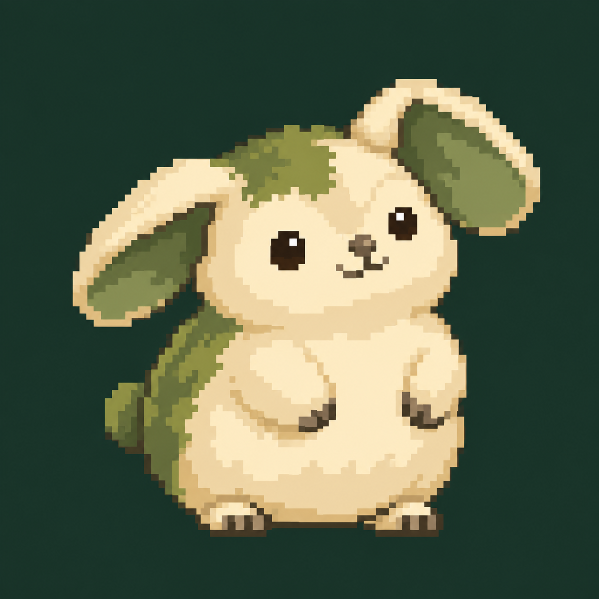
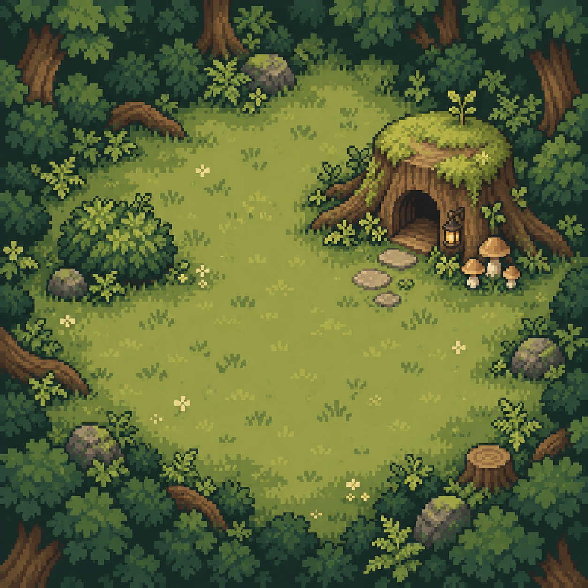

> Исходные художественные концепты и прежние решения. Рабочие ассеты перечислены [здесь](../../../public/world/README.md); команды запуска — в [README](../../../README.md).

# Пиксельный Мохлик: второе состояние кнопки

Пиксельный Мохлик включён в релиз **0.6.0** в `master`. Основной интерфейс взят из `master` (`607dcc2`): обычная кнопка, её эффекты, статус, серверный индикатор, профиль, люди и навигация сохраняют прежний вид.

Рядом с индикатором сервера добавлена кнопка с кроликом. Она переключает **обычную кнопку ↔ Мохлика**. Переключатель не создаёт отметку и не добавляет игровой клик. По умолчанию показана обычная кнопка; Canvas загружается после первого включения Мохлика. Переключения между видами сохраняют текущую сцену.

Страница `/mochlik`, мастерская и режим исследования удалены. Все действия питомца происходят самостоятельно внутри основной кнопки. Сама кнопка продолжает принимать отметки и игровые нажатия.

## Запуск

```bash
git switch master
git pull --ff-only origin master
npm ci
npm run dev:local
```

Открыть обычное приложение по `http://localhost:3000/`, войти и нажать кнопку с кроликом возле индикатора сервера. Если терминал назначил другой порт, использовать его. Старый сервер перед обновлением остановить через Ctrl+C. `npm run dev:mochlik` сохранён как совместимый вариант локального запуска; специального флага окружения больше нет.

## Поведение

- Через **60 секунд без нажатий** Мохлик завершает короткое действие, идёт домой и остаётся спать. Нажатие основной кнопки будит его. Повторные клики поддерживают активность, не сбивая переходы.
- Три грибницы отрастают за **70, 100 и 130 секунд**. Мохлик подходит к спелому грибу, нюхает, наклоняется, поднимает его лапами, откусывает три кусочка и проглатывает остаток. Гриб на земле и гриб в лапах — один объект; съеденный гриб начинает расти заново после завершения еды.
- Тень под персонажем убрана. Во время выхода из куста нет положительного вертикального смещения, которое раньше показывало светлую полоску под листвой. Выглядывание поднимает голову над кустом, а прыжок использует обычную дугу.
- **07:00–19:00** — день, фонарик выключен; **19:00–07:00** — сумерки, фонарик включён. Используется часовой пояс профиля и время приложения с серверной поправкой. Это заданные часы, не расчёт восхода по координатам. Освещение не отправляет питомца спать и не будит его.
- Во сне над домиком движутся пять букв Z с разными скоростями, дрейфом и прозрачностью. Их траектории случайно выбираются при создании сцены, а не меняются на каждом кадре. При уменьшении движения остаются три неподвижные буквы.
- Скрытая вкладка, закрытый вид Мохлика и открытые диалоги останавливают отрисовку. При возвращении учитывается время роста и бездействия; движение не перематывается.

Сцена локальна для устройства. Последнее посещение сохраняется: после отсутствия от пяти минут Мохлик спит и просыпается за три нажатия. Полученные предметы, достижения и игровой прогресс хранятся в аккаунте. Старые грибы, нарисованные возле домика на карте, — декорация; съедобные растут отдельно.

## Проверка

- Переключение вида не меняет счётчики, отметку или серверный статус; обычный вид сохраняет эффекты из master.
- На кнопке Мохлика каждое нажатие даёт отклик надписи и круглую волну.
- После минуты без нажатий питомец спит до следующего действия; смена дня и сумерек сон не прерывает.
- Чтобы посмотреть еду, дать грибам созреть и разбудить Мохлика. Рост намеренно дольше первого таймера бездействия.
- В прыжке и выходе из куста нет предварительного проваливания под листву.
- Часовые пояса с разными местными часами и переходом на летнее время дают корректное освещение.

## Код и рисунки

- `features/mochlik/habitat.ts` — движения, рост, сон и очередь действий.
- `features/mochlik/feeding.ts` — общие фазы еды и момента поглощения.
- `features/mochlik/lighting.ts` — день и сумерки в часовом поясе профиля.
- `features/mochlik/pixel-frame.ts` — поза, направление, выглядывание.
- `features/mochlik/pixel-sprite.ts` — редактируемый спрайт 48×48 и позы лап/лица.
- `features/mochlik/scene.ts` — Canvas 256×256, листва, удерживаемый гриб, свет и буквы сна.
- `public/world/maps/home-clearing.webp` — прежняя лесная карта; теперь доступна в истории Git. Текущие файлы перечислены в [каталоге графики](../../../public/world/README.md).

Персонаж нарисован кодом по мотивам концепта. Карта — уменьшенный концепт, не тайлсет. Референсы ImageGen сохранены ниже; исходные запросы — в `prompts.txt`.





Полный список изменений и порядок обновления: [релиз 0.6.0](../../releases/release-0.6.0.md).
