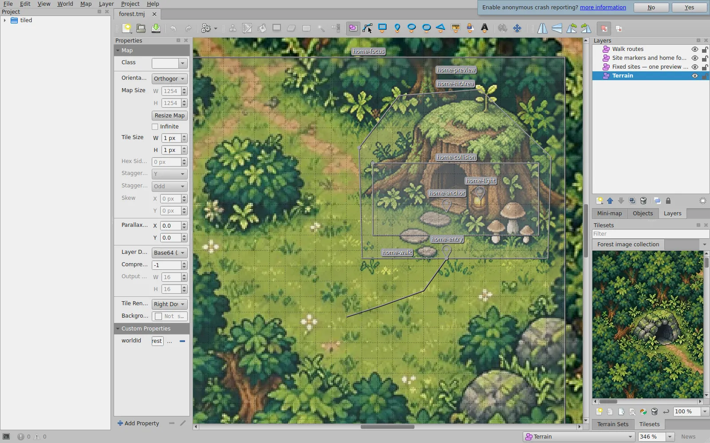

# Карта Мохлика в Tiled

Исходник сцены — `world/tiled/forest.tmj`, проект редактора — `world/tiled/forest.tiled-project`. Геометрия мира хранится в Tiled; приложение получает проверенный файл `features/world/tiled/forest.generated.json`. Этот файл генерируется автоматически.

Сцена использует свободно размещённые изображения. Дом и мастерская имеют постоянное место, точку опоры и вход; при улучшении меняется изображение выбранного уровня. Размер рабочей области — 1254 × 1254 логических единиц. Размер клетки 1 × 1 служит единицей измерения, раскладывать рисунок по клеткам не требуется.

Художественные исходники передаются отдельно в `zhiv-tiled-world-art-originals.zip`: перед их редактированием распакуйте архив в корень репозитория, чтобы пять PNG оказались в `world/tiled/art/`. [Состав и контрольные суммы](../../world/tiled/art/README.md). Для открытия редактора, просмотра страницы и `npm run world:check` распаковка не требуется: рабочие WebP уже включены в ветку. Скрипт `scripts/prepare-tiled-assets.mjs` собирает из них и двух исходных карт семь WebP в `public/world/tiled/`; координаты обрезки и мягкие края заданы в этом рецепте. Сгенерированные WebP вручную не правьте: команда `npm run world:assets` перезаписывает их. После правки художественного исходника или рецепта выполните `npm run world:assets`, затем `npm run world:export`.

## Открыть и проверить

1. Установите [Tiled](https://www.mapeditor.org/). Нативная проверка выполняется в Tiled 1.12.2.
2. Откройте `world/tiled/forest.tiled-project`, затем `forest.tmj` из дерева проекта. Файлы изображений должны оставаться в `public/world/tiled/`. В панели набора изображений уменьшите масштаб, если крупный фон занимает всю панель.
3. При необходимости отключите показ сетки и заблокируйте фон замком у слоя **Terrain**, чтобы случайно его не сдвинуть. Для перемещения используйте инструмент **Select Objects** (`S`). Изображения вставляются инструментом **Insert Tile** (`T`), точки — `I`, полигоны — `P`, редактирование вершин — `E`. Удерживание `Ctrl` переключает привязку к сетке. [Инструменты Tiled](https://doc.mapeditor.org/en/stable/manual/objects/).
4. Сохраните карту и выполните из корня репозитория:

   ```bash
   npm run world:export
   npm run world:check
   npm run dev:local
   ```

5. Откройте `/prototype/tiled-world`. Проверьте переключение уровней, попадание по зданиям, общий вид и приближение к дому. Вместе с исходником сохраняйте обновлённый `forest.generated.json` и изменённые изображения.

Временный файл `*.tiled-session` хранит открытые вкладки и состояние редактора; в Git он не нужен. [Проекты и сессии Tiled](https://doc.mapeditor.org/en/stable/manual/projects/).

## Слои и свойства

Все слои — **Object Layer**, порядок рисования — **Manual** (`draworder: index`). Их имена можно менять: назначение определяется пользовательским свойством `role`. Фоновые объекты должны предшествовать зданиям. Перед сохранением для экспорта включите видимость всех слоёв и объектов; непрозрачность должна быть 100%.

| Объект | Форма | Свойства |
| --- | --- | --- |
| Фон | Изображение из набора | `role: terrain` |
| Постоянное место здания | Одно изображение | `role: site`, `siteId`, `label`, `initialLevel` |
| Точка опоры | Точка | `role: anchor`, `siteId` |
| Вход | Точка | `role: entry`, `siteId` |
| Источник света | Точка, необязательная | `role: light`, `siteId` |
| Область нажатия | Замкнутый полигон | `role: hitArea`, `siteId` |
| Геометрия препятствия | Замкнутый полигон | `role: collision`, `siteId` |
| Область приближения к дому | Один прямоугольник | `role: focus` |
| Маршрут | Незамкнутая линия | `role: path`; имя объекта — ID маршрута; `siteId` необязателен |

Тип всех перечисленных свойств — **string**, кроме `initialLevel`: он должен быть **int**. В свойствах карты задано `worldId: forest` типа **string**. Идентификаторы пишутся латиницей в нижнем регистре; допустимы цифры, дефис и подчёркивание. Для каждого здания обязательны ровно одна точка опоры, один вход и по одному полигону `hitArea` и `collision`. Полигоны должны быть простыми: без самопересечений, повторных вершин и прохода назад по уже проведённому ребру.

Координаты изображений обозначают верхний левый угол: у встроенного набора **Forest image collection** значение **Object Alignment** должно оставаться **Top Left**. Это существенно: стандартное выравнивание Tiled для ортогональной карты другое. Вершины полигона хранятся относительно его собственной позиции; экспортёр переводит их в общие координаты мира. [Формат JSON](https://doc.mapeditor.org/en/stable/reference/json-map-format/).

## Переместить здание

Выделите его изображение и все связанные маркеры с тем же `siteId`, затем переместите их вместе. Отдельно подправьте подходящий маршрут. Если перемещаете дом, проверьте прямоугольник `home-focus`: он задаёт область приближения. Все точки и границы должны оставаться внутри карты.

Масштаб изображения меняйте пропорционально. Например, файл дома 568 × 536 занимает на карте 142 × 134 единицы. Ширина и высота спрайта, точка опоры, вход и контуры относятся ко всему зданию, а не к отдельному уровню. После перемещения проверьте каждый вариант улучшения.

Текущие изображения зданий — непрозрачные фрагменты участка с согласованной кромкой. Они подготовлены под существующее место на карте. Для переноса здания с сохранением рисунка почвы нужно также пересогласовать художественные исходники и координаты обрезки в `scripts/prepare-tiled-assets.mjs`. Перемещение в Tiled само по себе эту художественную работу не выполняет.

## Изменить или добавить уровень

Встроенный набор изображений содержит каталог вариантов: `home` уровней 1–3 и `workshop` уровней 0–2. На карте размещено только одно изображение каждого здания. Остальные варианты находятся в наборе, их не нужно накладывать друг на друга на сцене.

Первый уровень дома получается из исходной `public/world/maps/home-detail-v1.png`, пустое место мастерской — из `public/world/maps/forest-region-v3.png`. Эти две карты сохраняются неизменными. Если нужно перерисовать такие состояния, добавьте отдельный PNG в `world/tiled/art/` и подключите его в рецепте.

1. Измените соответствующий PNG в `world/tiled/art/`. Для нового уровня добавьте исходник и его обработку в `scripts/prepare-tiled-assets.mjs`. Для всех вариантов одного здания сохраняйте одинаковый холст, масштаб рисунка, основание, вход и положение источника света. Выполните `npm run world:assets`.
2. Откройте редактирование встроенного **Forest image collection**. Для нового варианта добавьте полученный WebP из `public/world/tiled/` и задайте свойства плитки: `role: siteState` (**string**), `siteId` (**string**), `level` (**int**) и `label` (**string**). Номер уровня в пределах здания должен быть уникальным. При обновлении существующего файла его ссылка в наборе остаётся прежней.
3. Чтобы посмотреть вариант в редакторе, выделите размещённое изображение здания; в наборе щёлкните нужный вариант правой кнопкой и выберите **Replace Tile of Selected Objects**. Проверьте, что позиция и размеры объекта сохранились.
4. Начальный уровень приложения задаёт свойство `initialLevel` размещённого объекта. Выбранная для просмотра плитка в Tiled сама по себе его не меняет. Значение должно соответствовать существующему уровню каталога.
5. Сохраните карту, выполните `npm run world:export` и `npm run world:check`, затем проверьте все уровни в браузере. Замена файла изображения обновляет версию его URL при экспорте.

## Поддерживаемая часть Tiled

Экспортёр принимает конечную ортогональную карту, встроенные наборы отдельных изображений и описанные выше объекты. Он проверяет ссылки на здания, наличие обязательных маркеров, свойства и их типы, размеры файлов, пропорции, границы мира и пути внутри `public/`.

В этой версии не поддерживаются внешние наборы и шаблоны, группы и тайловые слои, поворот и отражение изображений, смещения и параллакс слоёв, анимации плиток, тонирование, пониженная непрозрачность слоёв и объектов, а также скрытые объекты. Прозрачные пиксели внутри самого PNG или WebP допустимы. Не добавляйте произвольные пользовательские свойства: неизвестное поле вызывает понятную ошибку проверки. Это ограничение экспортёра приложения, а не редактора Tiled.

## Нативная проверка Tiled

Финальная карта проверена в Tiled 1.12.2: проект и карта открылись в редакторе, семь изображений прочитались, нативный экспорт и растеризация завершились успешно. Повторно экспортированная карта после обработки нашим компилятором дала полностью идентичную сцену: мир 1254 × 1254, два места зданий, шесть состояний и маршрут `home-walk`. Фоновая текстура имеет размер 1254 × 1254.



Обычный рабочий цикл использует сохранённый `.tmj` напрямую. Дополнительно можно проверить его собственным экспортёром и растеризатором Tiled. Следующие команды рассчитаны на Linux/macOS; каталог `tmp/tiled` — временный.

```bash
mkdir -p tmp/tiled
tiled --project "$PWD/world/tiled/forest.tiled-project" \
  --export-map json "$PWD/world/tiled/forest.tmj" \
  "$PWD/tmp/tiled/forest-roundtrip.tmj"
tmxrasterizer --no-smoothing \
  --show-layer Terrain \
  --show-layer "Fixed sites — one preview per site" \
  "$PWD/world/tiled/forest.tmj" "$PWD/tmp/tiled/forest-native.png"
node scripts/tiled-world.mjs tmp/tiled/forest-roundtrip.tmj \
  tmp/tiled/forest-roundtrip.generated.json
```

Используйте абсолютные пути при нативном экспорте: в проверенной версии относительный путь назначения может неверно пересчитать ссылки на изображения. Возврат кода 0 сам по себе не доказывает наличие всех изображений; проверьте повторный импорт нашим экспортёром и полученный рисунок. Сравнивать исходный и повторно сохранённый `.tmj` побайтно не нужно: Tiled меняет порядок свойств и формат записи чисел.

На Linux без графической сессии нативному Tiled требуется виртуальный дисплей, например `xvfb-run`. [Экспорт Tiled](https://doc.mapeditor.org/en/stable/manual/export/).
