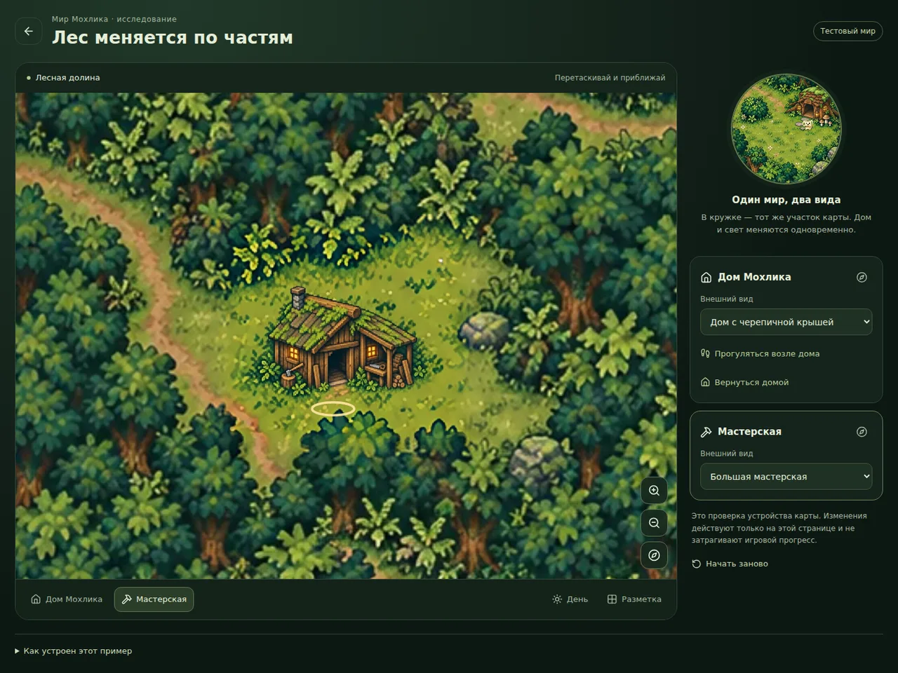

# Проверка прототипа Tiled

Дата первоначальной проверки: 21 сентября 2026. Ветка: `feature/mochlik-tiled-world`, исходная точка master — `167da037866885570388137c44d374ae41fc5b9d`.

Таблица, браузерный протокол и снимки ниже относятся к прототипу до последующей уборки изображений. Числа 373 и 31 + 4 — результаты той проверки, а не текущий итог тестов после изменения экспорта.

## Исторические результаты первоначального прототипа

| Проверка | Результат |
| --- | --- |
| `npm run typecheck` | Пройдена |
| `npm run lint` | Пройдена |
| `npm run build:vps` | Пройдена; `/prototype/tiled-world` собирается как статическая страница |
| `npm run build` | Пройдена; собран вариант vinext/Sites |
| `npm run test:web` после сборки Sites | Все 373 теста пройдены, 0 ошибок и 0 пропусков |
| Новые тесты | 31 проверка компилятора и 4 проверки состояния/попадания по объектам пройдены |
| `npm run world:check` | JSON соответствует актуальной Tiled-карте и хешам изображений |
| [Прежняя проверка нарезки](https://github.com/NolReaction/zhiv-app/blob/ffd97ca868365e257b6eabe0fed52334a2f86a0a/scripts/prepare-tiled-assets.mjs) (`--check`) | Семь изображений воспроизводились побайтно; выполнено с оригиналами из отдельного ZIP |
| Tiled 1.12.2 | Настоящий редактор открывает проект и карту; нативный экспорт и растеризация работают |
| Повторный импорт после нативного экспорта | Полное совпадение с исходной скомпилированной сценой, включая последние координаты входа мастерской |
| Исходные карты | Контрольные суммы двух производственных PNG сохранены |

Сборка vinext выводит предупреждения существующей Vite-конфигурации о будущем `configLoader: native`; новых ошибок сборки нет. Backend, миграции, серверные команды и основной игровой интерфейс не изменялись. Локальные Ktor/PostgreSQL/Compose-тесты в эту проверку не входили.

## История исходников и последующая уборка

Изначально пять полных художественных заготовок передавались отдельно в `zhiv-tiled-world-art-originals.zip`; затем они вошли в коммит [`ffd97ca`](https://github.com/NolReaction/zhiv-app/tree/ffd97ca868365e257b6eabe0fed52334a2f86a0a/world/tiled/art). Проверка исходного ZIP использовала STORE, CRC и совпадение SHA-256 семи изображений, включая две производственные карты. Эти сведения относятся к прежним полным заготовкам.

Теперь для редактирования используются семь готовых PNG в `art/world/prototype/`, полученных из пикселей прежнего рецепта до сжатия. Их контрольный экспорт с прежним качеством WebP 90 воспроизводит все семь существующих WebP побайтно. В рамках уборки рабочие WebP не перекодировались: изменены только имена и ссылки. Прежние пять заготовок, рецепт автоматической нарезки и его инвентарь удалены из рабочего дерева и доступны в истории Git.

Текущий порядок: изменить готовый PNG, вручную экспортировать целиком в одноимённый WebP, выполнить `npm run world:export` и `npm run world:check`. Эти команды не меняют изображения; экспорт обновляет размеры в Tiled и версии URL, проверка работает без записи. [Полная инструкция](../../art/README.md).

## Проверки после уборки

Повторно проверены актуальные пути и упрощённый порядок редактирования:

| Проверка | Результат |
| --- | --- |
| `npm run test:web` | 376 тестов пройдены, 0 ошибок и пропусков |
| `npm run typecheck`, `npm run lint` | Пройдены |
| `npm run build:vps`, `npm run build` | Обе сборки пройдены |
| `npm run world:export`, `npm run world:check` | Карта и JSON согласованы, изображения не изменяются |
| Нативный экспорт Tiled 1.12.2 | Повторная компиляция даёт побайтно тот же JSON сцены |
| Production Next.js в Chromium | 14 проверок пройдены: уровни, камеры, жесты, ориентация, ошибки загрузки и все пять переименованных изображений обычной игры |
| PNG → прежние настройки WebP | Все семь подготовленных PNG воспроизводят существующие WebP побайтно |

Браузерный прогон не обнаружил необработанных ошибок JavaScript или запросов к API аккаунта. Это проверка Chromium на desktop и эмулированных мобильных размерах; реальный iPhone/Safari не проверялся. Дополнительно проверены ссылки изменённых Markdown-файлов и `git diff --check`.

## Браузерная проверка первоначального прототипа

Проверена **production-сборка Next.js**, а не только отдельный рисунок на Canvas. Использовался Chromium 151.0.7922.34 через Playwright. Размеры: desktop 1440×1000, touch portrait 390×844 с DPR 3, landscape 844×390. Протокол: [tiled-browser-checks.json](tiled-browser-checks.json).

Проверены:

- Начальная загрузка, успешная гидратация и исходные состояния дома/мастерской.
- Независимое переключение уровней. Изменение дома меняет пиксели кружка; изменение мастерской сохраняет пиксели домашнего вида.
- Одинаковые состояние ночи и координаты персонажа у обеих камер.
- Кнопки масштаба, клавиатурное перемещение и настоящий ввод touch pinch через браузер.
- Перестройка Canvas при изменении ориентации без горизонтального переполнения страницы.
- Прогулка по домашнему пути и возвращение в исходную точку.
- Reduced motion: мгновенный переход к назначению без анимации движения.
- Отсутствие продолжающегося цикла кадров, когда сцена неподвижна.
- Принудительная ошибка загрузки нового уровня: предыдущая сцена сохраняется, повторная попытка восстанавливает нужный вид.
- Задержанный ответ старого улучшения после выбора следующего: выбранное позднее состояние сохраняется.
- Отсутствие необработанных JavaScript-ошибок; на проверенной странице не обнаружены запросы к API аккаунта.

Ошибки загрузки и гонка запросов проверялись в отдельных браузерных контекстах с отключённым service worker, чтобы намеренно задержать/прервать именно запрос изображения. Основной успешный сценарий выполнялся с обычными настройками браузера.

Это не проверка на настоящем iPhone/Safari или Android-устройстве. Физическое устройство ещё нужно проверить перед внедрением в основную игру. Автоматическая блокировка ориентации, полная офлайн-работа, магазин приложений и серверное сохранение прогресса этим прототипом не заявляются.

## Первоначальная проверка графики

Все уровни отдельно просмотрены в собранной сцене. Убрана резкая граница детализации домашнего патча: край теперь согласован с фактическим разрешением земли. Дубли старого дома, обрезанные крыши и старый куст внутри мастерской при проверке не обнаружены. Детализация интерьера участков выше, чем у общего леса; это осознанное свойство примера, художественная полировка остаётся отдельной задачей.

Фон и два начальных состояния: **858 106 байт**. Все семь runtime-изображений: **1 194 050 байт**. Это вес изображений, без JavaScript, шрифтов и общего интерфейса приложения. PNG браузер не скачивает; текущие редактируемые файлы находятся в `art/world/prototype/`.

Вход мастерской скорректирован на траву `(201,545)`, препятствие заканчивается на `y=538`. Непроверенный путь через весь лес убран: по картинке нельзя надёжно определить проходимость без отдельной разметки.

## Снимки первоначальной рабочей страницы

Это снимки до уборки имён файлов; повторная съёмка в рамках уборки не заявляется.

[Мобильный вид после проверки и исправления ширины переключателей](images/world-prototype-mobile.webp). [Настоящий редактор Tiled](images/tiled-editor-screenshot.webp).

## Утренняя ручная проверка

Запуск и последовательность действий: [решение по устройству мира](tiled-world-decision.md#что-можно-проверить-сейчас). При оценке важнее всего проверить, нравится ли выбранный способ развития конкретных мест и художественный масштаб новых построек. Это решение можно принять до переноса прототипа в основной игровой экран.
